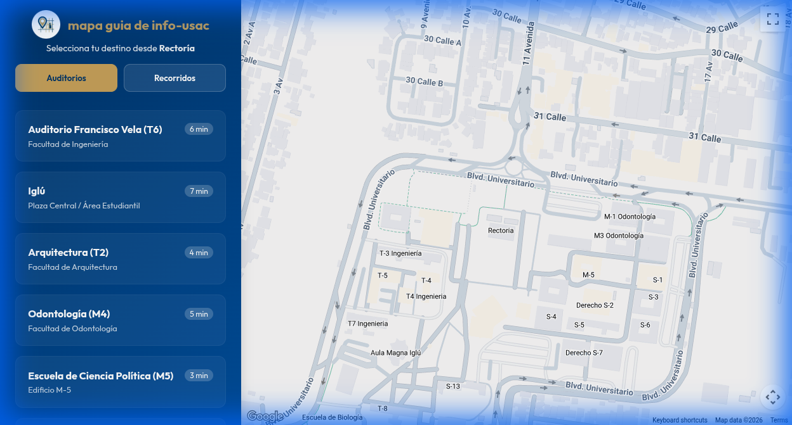

# Mapa Guía Info-USAC 🗺️

Sistema interactivo de navegación inteligente diseñado para orientar a la comunidad universitaria en el campus central de la Universidad de San Carlos de Guatemala (USAC). 

Este sistema no solo traza rutas, sino que **entiende tu contexto** y te guía de forma segura hacia tu destino.

---

## 🚀 Características Principales

### 🔴 Doble Motor de Navegación
1. **Modo Auditorios (Smart Origin):** 
   - **Flexibilidad de Inicio:** Elige entre salir desde el punto neurálgico (**Plaza las Banderas**) o usar tu **Ubicación en Tiempo Real**.
   - Selección rápida de facultades y auditorios principales.
   - Estimación real del tiempo de caminata y trazado dinámico que se actualiza mientras te mueves.
2. **Modo Recorridos (Smart Tour):**
   - Sistema dinámico mediante checklist para trámites administrativos (SUN, Bienestar, Registro).
   - **Proximidad Inteligente:** Los puntos se marcan solos cuando estás cerca (radio de ~30m).
   - Guía adaptativa: Te sugiere siempre el punto más cercano a tu ubicación actual.

### 📱 Experiencia de Usuario Premium
- **Interfaz Adaptativa:** Sidebar colapsable que se transforma en un menú desplegable inteligente en dispositivos móviles.
- **Visualización Limpia:** Mapa personalizado que oculta distracciones (negocios externos, tráfico innecesario) para enfocarse en el campus.
- **Seguridad Activa:** Notificaciones flotantes de precaución al iniciar cualquier trayecto.
- **Estética "Dark Mode":** Diseño elegante con contrastes en azul profundo y dorado universitario.

---

## 📸 Previsualización

| Vista Escritorio | Vista Móvil |
| :--- | :--- |
|  |  |

---

## 🛠️ Stack Tecnológico

- **Core:** JavaScript ES6+ (Vanilla)
- **Maps API:** Google Maps JavaScript API (Directions Service, Directions Renderer)
- **Styling:** CSS3 con variables dinámicas, Flexbox y Glassmorphism.
- **Geolocalización:** HTML5 Geolocation API para seguimiento en tiempo real.

---

## ⚙️ Configuración y Despliegue

El sistema está diseñado para ser ligero y fácil de configurar:

1. **Obtén tu API Key:**
   - Ve a [Google Cloud Console](https://console.cloud.google.com/).
   - Activa las APIs: `Maps JavaScript API` y `Directions API`.

2. **Configura las credenciales:**
   - Localiza el archivo `assets/config.js`.
   - Inserta tu llave:
     ```javascript
     const APP_CONFIG = {
         googleMapsApiKey: "TU_API_KEY_AQUI"
     };
     ```

3. **Ejecución:**
   - No requiere servidor backend. Simplemente abre `index.html` en un navegador moderno.

---

## 📂 Estructura del Proyecto

- `index.html`: Punto de entrada y contenedor de la interfaz.
- `assets/app.js`: Cerebro de la aplicación (Lógica de mapas, geocercas y gestión de estados).
- `assets/style.css`: Capa estética y responsividad móvil.
- `assets/config.js`: Gestión de configuración sensible (Excluido de Git).
- `assets/logo.png`: Identidad visual del proyecto.

---

## 🚶 Guía de Uso Rápido

1. **¿Buscas un Auditorio?** Selecciónalo en la lista izquierda. Verás la ruta azul desde Rectoría.
2. **¿Haces trámites?** Cambia a "Recorridos". Camina hacia los puntos; el sistema actualizará tu progreso automáticamente.
3. **¿Terminaste?** El botón "Finalizar en Plaza las Banderas" te regresará al punto de inicio seguro.

---
Diseñado con ❤️ para la comunidad sancarlista por **Info-USAC** @ 2026 Chalecos Cafe ☕.

